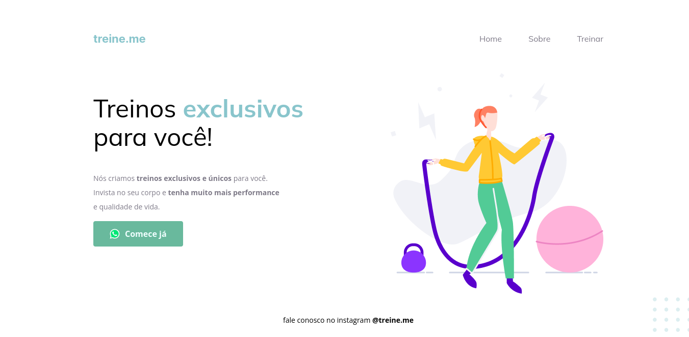

# Projeto 02

Acesse em: <a href="https://lfoalves.github.io/treine-me" title="Acessar o site da Treine Me">Treine.me</a>

LAYOUT

## Semântica - Hypertext Markup Language
tags html com significado para o browser e para a acessibilidade

## Box Model - Cascading Style Sheets
* largura
* altura
* conteúdo
* espaço externo
* borda
* preenchimento

## Refatoração e Acessibilidade
Organizando tags para melhorar a coerência e eficiência.

Author: <a href="https://www.linkedin.com/in/lfoalves/" target="_blank" title="Autor: Luiz Fernando Alves">Luiz Fernando Alves</a>
